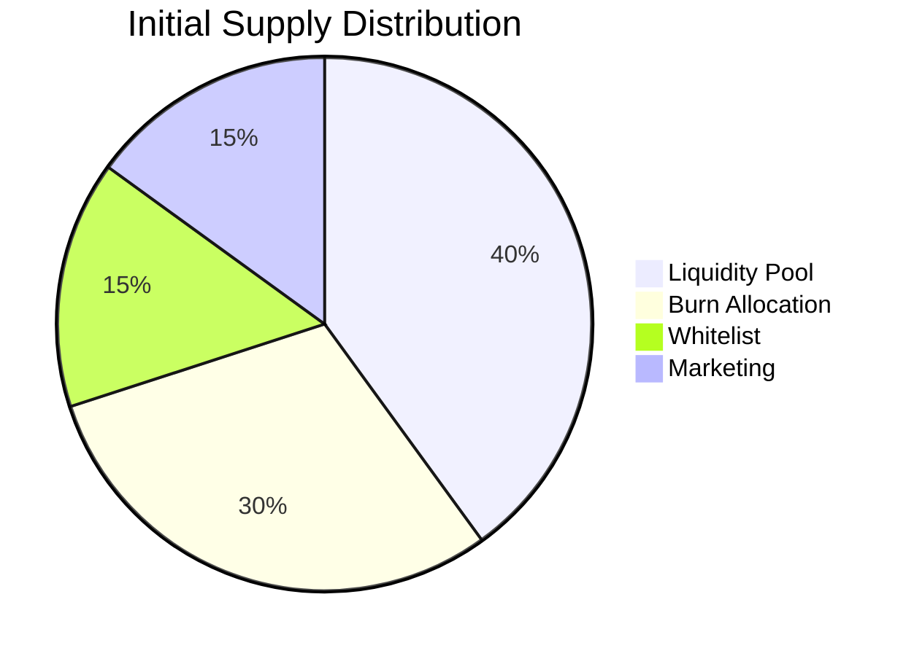
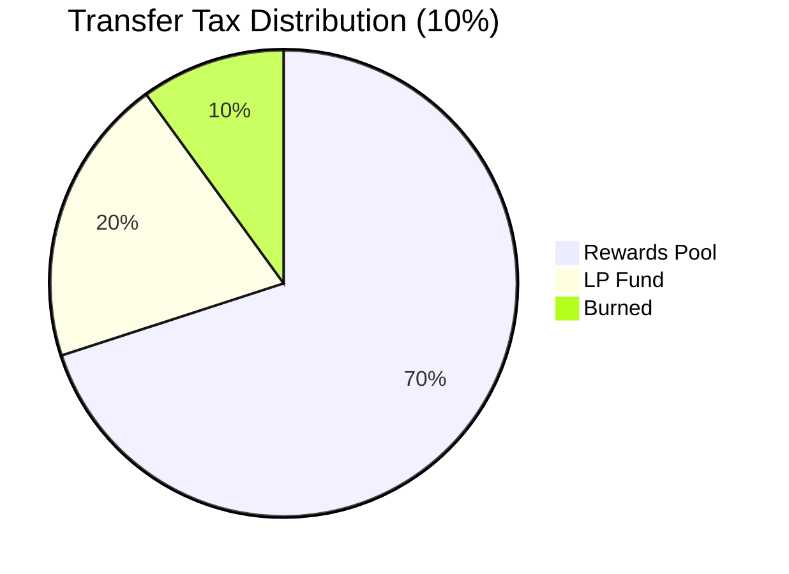

# My Anchor Token Program

Solana token program built with Anchor that implements advanced tokenomics including:
- Transfer taxes
- Whitelisting
- Liquidity pool rewards
- Token burning
- Admin controls

## Features

- **Initial Supply Distribution**:
  - 40% to Liquidity Pool
  - 30% allocated for burning
  - 15% to whitelisted wallets
  - 15% for marketing/development

- **Transfer Taxes**:
  - 10% tax on transfers to non-whitelisted wallets
  - Tax distribution:
    - 70% to rewards pool
    - 20% to LP fund
    - 10% burned

- **Admin Controls**:
  - Freeze/unfreeze contract
  - Transfer ownership
  - Manual token burning
  - Whitelist management

- **TVL Tracking**:
  - Liquidity pool balance
  - Staking pool balance
  - Rewards pool balance

## Tokenomics





## Program Architecture

### Key Accounts
- `TokenState` - Main program state
- `Whitelist` - Whitelisted wallets
- `MintAuthority` - PDA for minting authority

### Core Functions
- `initialize_token` - Initializes token with distribution
- `transfer_tokens` - Handles transfers with tax logic
- `manual_burn` - Admin-controlled token burning
- `prepare_rewards_swap` - Prepares rewards for distribution
- `transfer_ownership` - Transfers admin rights
- `freeze_contract` - Freezes/unfreezes contract

## Build & Test

### Prerequisites
- Rust 1.65.0+
- Solana CLI 1.18.2+
- Anchor 0.30.1+

### Build
```bash
anchor build
```

### Test
Run TypeScript tests:
```bash
anchor test
```

Run Rust tests:
```bash
cargo test
```

## Deployment

1. Update program ID in `Anchor.toml`
2. Configure cluster and wallet in `Anchor.toml`
3. Deploy:
```bash
anchor deploy
```

## Usage Examples

### Initialize Token
```typescript
await program.methods
  .initializeToken(totalSupply, whitelistWallets)
  .accounts({/* accounts */})
  .signers([admin])
  .rpc();
```

### Transfer Tokens
```typescript
await program.methods
  .transferTokens(amount)
  .accounts({/* accounts */})
  .signers([sender])
  .rpc();
```

### Burn Tokens
```typescript
await program.methods
  .manualBurn(amount)
  .accounts({/* accounts */})
  .signers([admin])
  .rpc();
```

## Testing

Comprehensive test coverage includes:
- Token initialization and distribution
- Transfer scenarios (whitelisted/non-whitelisted)
- Tax calculation and distribution
- Whitelist management
- Admin functions (freeze, ownership transfer)

Run all tests:
```bash
anchor test
```

## License

MIT
